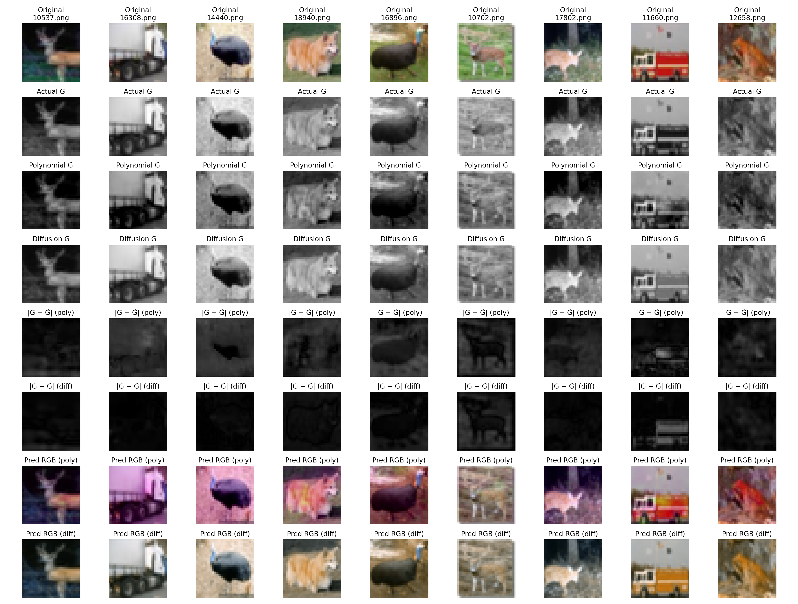
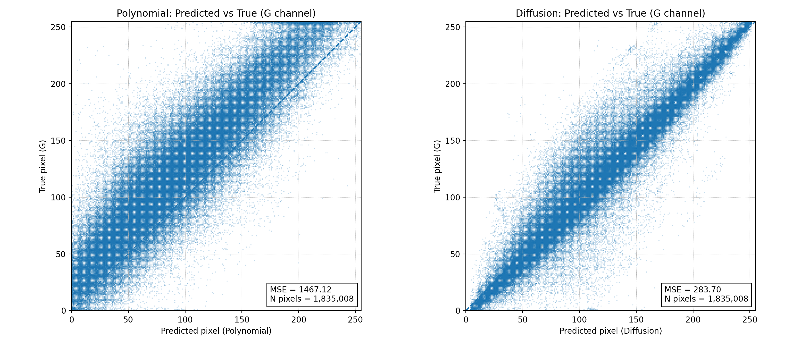

# AstroAI Task — RB→G Reconstruction

<p align="center">
  
  
</p>

> **TL;DR**: This repo reconstructs the **green (G)** channel of 32×32 color images from the **red (R)** and **blue (B)** channels.  
> Two approaches are implemented and compared:
> - A fast, classical **Polynomial Regression (RB → G)** baseline.
> - A **Conditional Diffusion model** that denoises G conditioned on RB.
>
> The figures above show (1) a visual side‑by‑side comparison of predictions and (2) pixel‑wise predicted‑vs‑true scatter with MSE.

---

## Contents
- [Overview](#overview)
- [Data & Preprocessing](#data--preprocessing)
- [Models](#models)
  - [Polynomial Regression (baseline)](#polynomial-regression-baseline)
  - [Conditional Diffusion model](#conditional-diffusion-model)
- [Training](#training)
- [Inference](#inference)
- [Experiments & Figures](#experiments--figures)
- [Repo Structure](#repo-structure)
- [Quickstart](#quickstart)

## Overview
The pipeline learns to reconstruct the **G** channel from **R** and **B** on CIFAR‑10 (32×32 RGB).  
We split each image into inputs **X = [R, B]** and target **Y = G**, then train:
1. **Polynomial Regression** using engineered polynomial features of (R,B) pixels with linear regression (SGD).
2. **Diffusion**: a UNet‑based denoising diffusion model that predicts the noise on G while conditioning on the fixed RB channels.

## Data & Preprocessing
Preprocessing lives in `preprocessing/`:
- `load_data.py` downloads CIFAR‑10 and exports **PNG** images (RGB) to `data/raw`.
- `split_channels.py` splits images into inputs **X = [R,B]** (saved as RGB with G=0 for convenience) and target **Y = G** (grayscale) under `data/split/x` and `data/split/y`.
- `split_traintest.py` creates `x_train`, `y_train`, `x_test`, `y_test` folders with a reproducible split.

> Paths in the scripts default to `/home/dils/astroai/task/...`. Adjust if needed.

## Models

### Polynomial Regression (baseline)
Code in `models/polynomial_reg/`:
- `model.py` streams over train images, fits a `StandardScaler`, expands polynomial features on (R,B), and trains an `SGDRegressor` to predict **G**.
- `artifacts/rb2g_deg2.joblib` stores the fitted scaler, polynomial transformer, and linear model.
- `inference.py` loads the artifact and writes predicted **G** PNGs to `outputs/polynomial_reg_predicted_y_test`.

**Why this baseline?**
- Extremely fast to train and run.
- Provides a strong per‑pixel mapping from (R,B) → G for comparison against the diffusion model.

### Conditional Diffusion model
Code in `models/diffusion/`:
- `train.py` trains a UNet denoiser to predict noise on **G**, given concatenated inputs `[noisy_G, R, B]`.
- `sample.py` draws samples of **G** conditioned on **RB**; checkpoints under `outputs/checkpoints/` (e.g., `last.pt`).
- Configs under `models/diffusion/configs/` (e.g., `rbg.yaml`). See `models/diffusion/README.md` for details.

**Intuition**
- The model learns the conditional distribution **p(G | R,B)** and can capture non‑linear and spatial dependencies beyond pixel‑wise polynomial mappings.

## Training

### 1) Prepare data
```bash
python preprocessing/load_data.py
python preprocessing/split_channels.py
python preprocessing/split_traintest.py
```

### 2) Train Polynomial Regression
```bash
python models/polynomial_reg/model.py
```
Artifacts are written to `models/polynomial_reg/artifacts/`.

### 3) Train Diffusion
```bash
cd models/diffusion
pip install -r requirements.txt   # optional, if not already installed
python train.py --config configs/rbg.yaml
```
Checkpoints will be saved under `models/diffusion/outputs/checkpoints/`.

## Inference

### Polynomial Regression
```bash
python models/polynomial_reg/inference.py
```
Outputs go to `outputs/polynomial_reg_predicted_y_test`.

### Diffusion
```bash
cd models/diffusion
python sample.py --config configs/rbg.yaml --ckpt outputs/checkpoints/last.pt --n 9
```
Samples/predictions go to `models/diffusion/outputs/samples/` and/or the experiment output folders you specify.

## Experiments & Figures
The plots in the header come from `experiments/`:

- `visualize.py` produces a **side‑by‑side comparison** of original vs. predicted images from both methods.  
  Output: `experiments/compare_diffusion_vs_poly.png`

- `scatter.py` creates **Predicted vs. True** pixel scatter plots for both models (with MSE overlay).  
  Output: `experiments/scatter_pred_vs_true.png`

To reproduce:
```bash
python experiments/visualize.py
python experiments/scatter.py
```

## Repo Structure
```
preprocessing/                 # load CIFAR-10, split channels, train/test split
models/
  polynomial_reg/              # RB→G baseline (scaler + poly features + SGD)
  diffusion/                   # UNet diffusion (RB-conditioned) + scripts/configs
experiments/                   # visualization & analysis scripts + output figures
```
Key, persistent outputs:
- `models/polynomial_reg/artifacts/rb2g_deg2.joblib`
- `models/diffusion/outputs/checkpoints/last.pt`
- `outputs/*` for predicted **G** test images

## Quickstart
1. Run preprocessing to materialize `data/` splits.
2. Train the polynomial baseline (`model.py`) and/or the diffusion model (`train.py`).
3. Run the experiment scripts to generate the figures.
4. Commit the results and this README to your GitHub repo.

---

_Authored for the **astroai_task** project. Feel free to adapt paths and hyper‑parameters for your environment._
